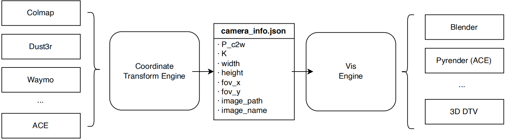

# VisAnything

# Environments
install the following packages

1. basic
- plyfile: for managing point cloud
- numpy
- skimage

2. ace visualization
- torch
- trimesh: for meshing camera traj
- pyrender: for rendering
- Pillow: for PIL Image
- scipy
- matplotlib
- skimage
- bisect

3. mono depth
- torch
- kornia: for mono depth to pcd
- Pillow: for PIL Image
- opencv-python: for cv2
- open3d: for point clouds

# Camera file config
camera name is `camera_info_opencv.json`
- `P_c2w`: camera to world matrix in opencv/colmap system, 4x4
- `K`: camera intrinsic parameter, 3x3
- `width`: image width
- `height`: image height
- `FovX`: fov x, calculated from K
- `FovY`: fov y, calculated from K
- `image_path`: relative path of image
- `image_name`: image name without .png/.jpg
