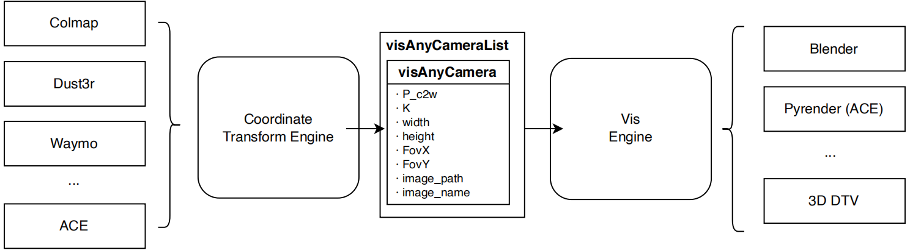

# VisAnything

# Camera file config
camera name is `camera_info_opencv.json`
- `P_c2w`: camera to world matrix in opencv/colmap system, 4x4
- `K`: camera intrinsic parameter, 3x3
- `width`: image width
- `height`: image height
- `FovX`: fov x, calculated from K
- `FovY`: fov y, calculated from K
- `image_path`: relative path of image
- `image_name`: image name without .png/.jpg
