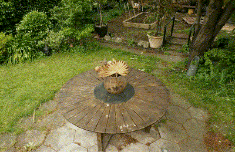

# VisAnything

# 1. Support free camera movement !!!

## Camera move demos

  

  
  
      
    
Blender Mesh
  
  
  

  
  
      
    
Blender Normal
  
  
  

  
  
      
    
3d Gaussian NVS
  
  
  

  

  
  
      
    
Blender Points
  
  
  

  
  
      
    
4d Gaussian NVS
  
  

## Pipeline
1. Import mesh or GS points in blender, and set camera track (see `setCamTrackInBlender.md`)
2. Run `visEngine/blender/export_cam_track.py`, to export cameras for all frames. These are
stored in `camera_track_opencv.json`
3. Read `camera_track_opencv.json` in any project, please refer to `demo_track_read.py`

# 2. Environments
install the following packages

1. basic
- plyfile: for managing point cloud
- numpy
- skimage

2. ace visualization
- torch
- trimesh: for meshing camera traj
- pyrender: for rendering
- Pillow: for PIL Image
- scipy
- matplotlib
- skimage
- bisect

3. mono depth
- torch
- kornia: for mono depth to pcd
- Pillow: for PIL Image
- opencv-python: for cv2
- open3d: for point clouds

# 3. Camera file config
cameras are stored in `camera_info_opencv.json` with following formats:
- `P_c2w`: camera to world matrix in opencv/colmap system, 4x4
- `K`: camera intrinsic parameter, 3x3
- `width`: image width
- `height`: image height
- `FovX`: fov x, calculated from K
- `FovY`: fov y, calculated from K
- `image_path`: relative path of image
- `image_name`: image name without .png/.jpg

