## 在blender里面设定相机轨迹教程
## 大致流程
1. 各种准备操作
2. 设置相机跟随（让相机始终朝向某个焦点）
3. 设置相机轨迹
4. 再次设置相机跟随（让相机对齐所设置的轨迹）
5. 时间轴预览
6. 设置向上方向

## Step 1. 准备操作，方便后续的预览
1. 注意检查mesh或点云需要从opencv坐标系变成blender坐标系，运行`visEngine/blender/mesh_cv2blender.py`
2. 新拉一个视图，让其变成摄像机视角，方便随时查看渲染结果
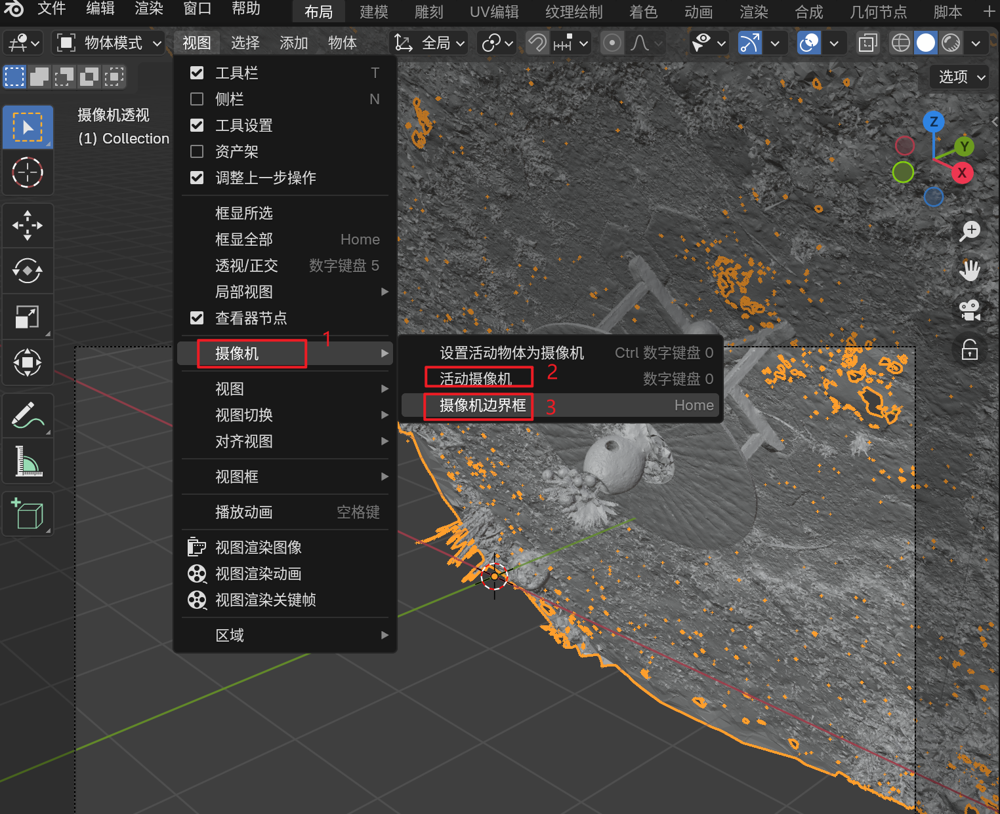
3. 设置摄像机外边框，让相机视角之外的变黑，方便预览
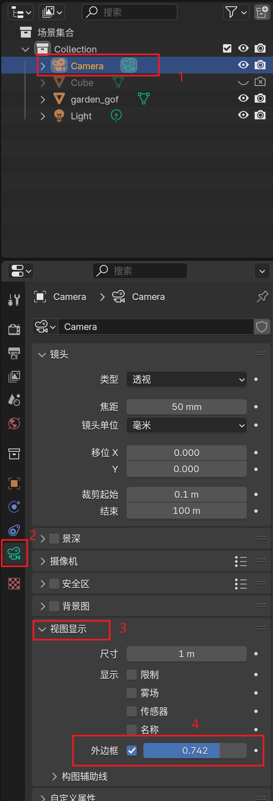

## Step 2. 设置相机跟随
这一步主要目的是让相机的镜头始终锁定某个物体，或某个地方，方便营造影视运镜
1. 为相机创建一个constrain
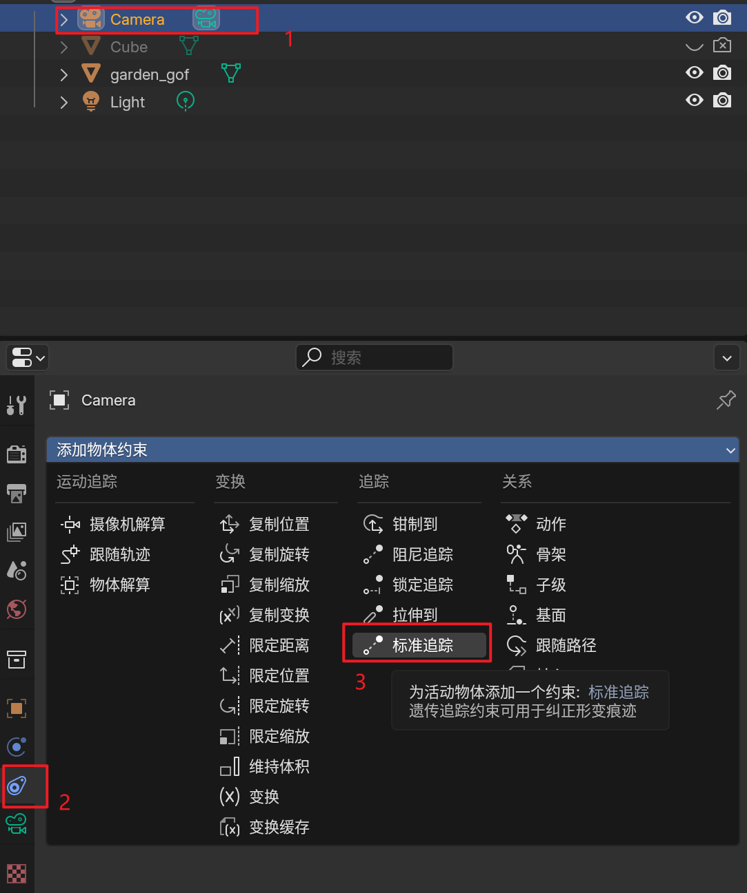
2. 在场景中创建一个空物体，并随意移动空物体位置，让相机始终锁定空物体
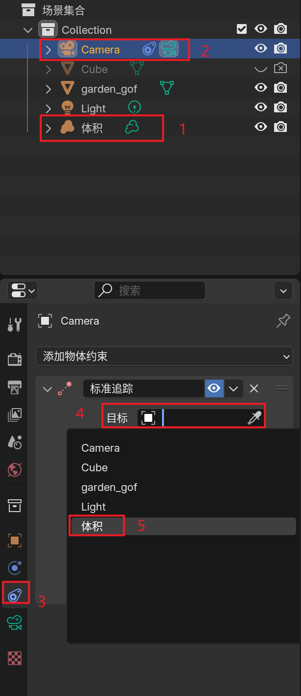
3. 得到如下效果，无论怎么移动相机，相机始终指向空物体所在位置
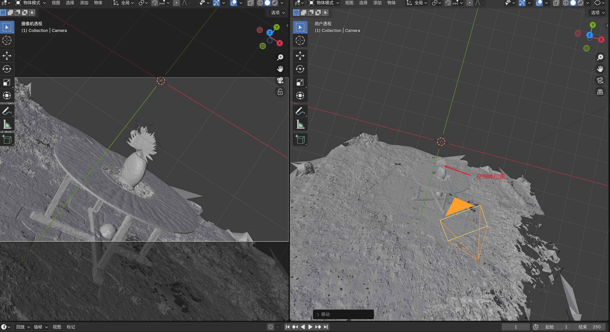

## Step 3. 设置相机轨迹
1. 创建路径曲线
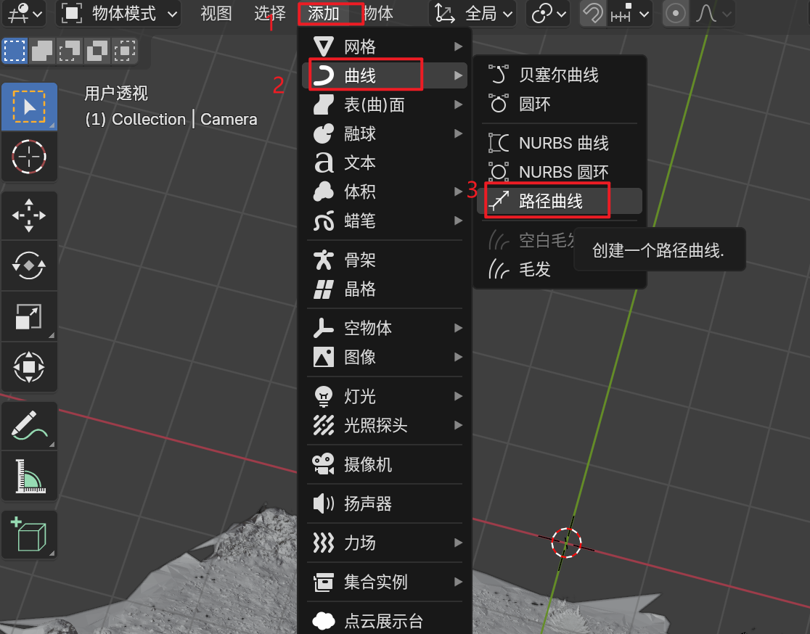
2. 进入编辑模式，编辑路径曲线

## Setp 4. 再次设置相机跟随
因为设置好了曲线，再次使用constrain面板让相机跟随曲线
1. 退出编辑模式
2. 设置跟随路径
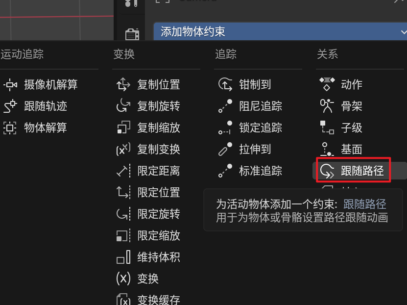
3. 让之前的镜头锁定处于跟随路径下面，然后设置跟随路径为NURBS路径
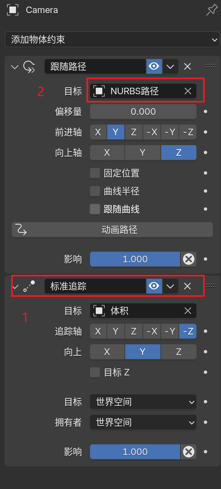
4. 让相机原点对齐路径某个点
- 选择路径曲线，进入编辑模式
- 选择某个路径点，shift+S快捷键，让游标对齐这个点
- 退出编辑模式，选择相机，shift+S快捷键，让相机原点对齐游标
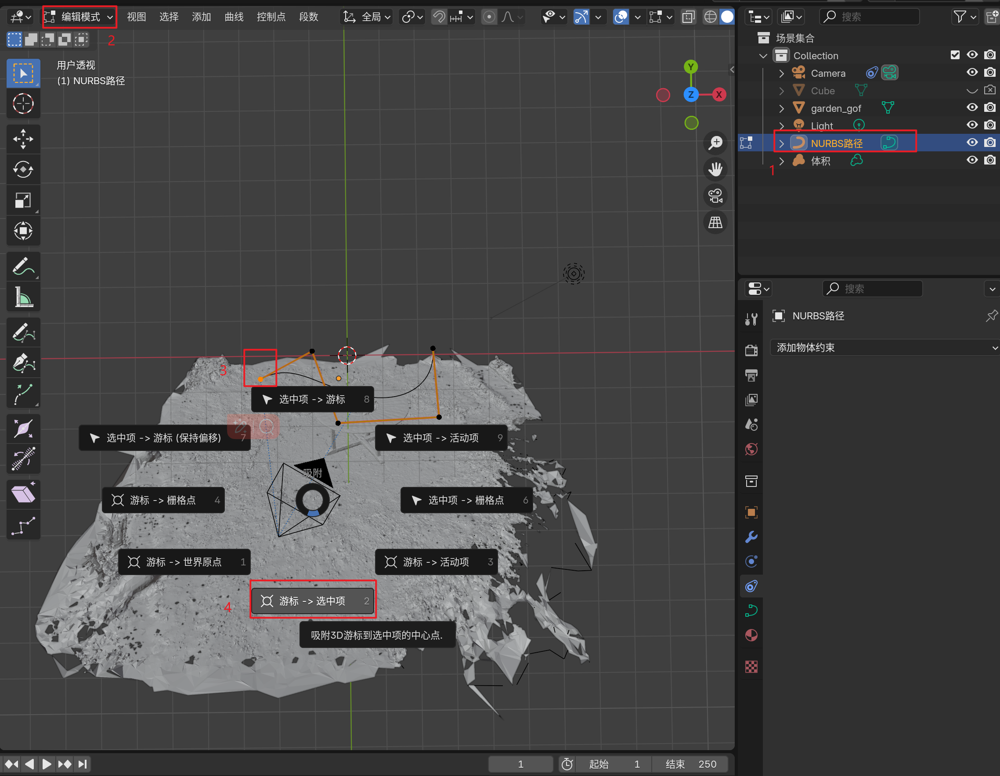
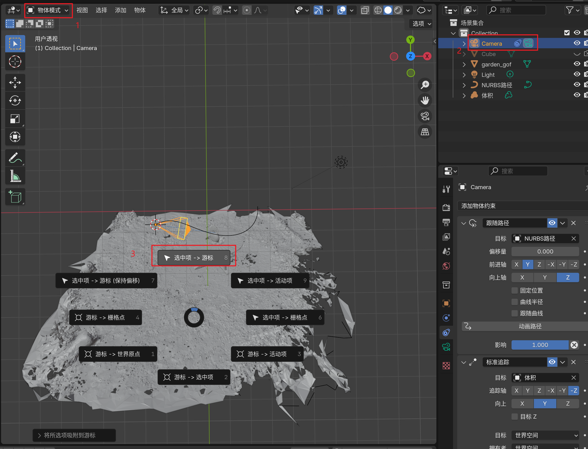

## Step 5. 设置时间轴
1. 时间轴上选择第0帧
2. 点击constrain面板路径的偏移量，打一下关键帧
3. 时间轴拉倒250帧
4. 先调节偏移量，再打一下关键帧
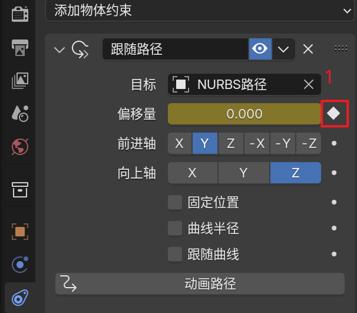
5. 选择所有关键帧，按下T键可以选择插值模式

## Step 6. 设置相机向上方向
有时候物体的z轴和全局的z轴并不一致，因此设置空物体的z轴方向后，让相机的跟随目标z
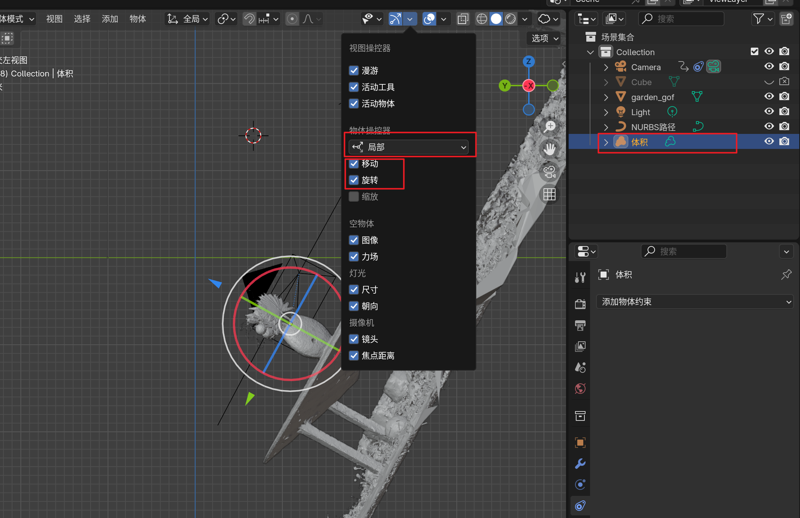
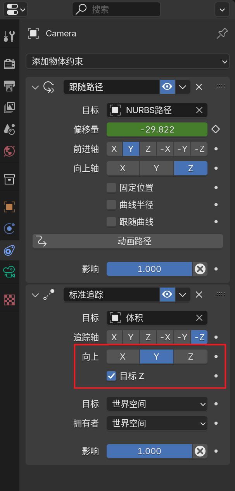

